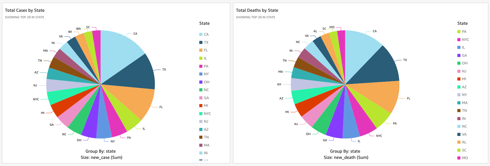
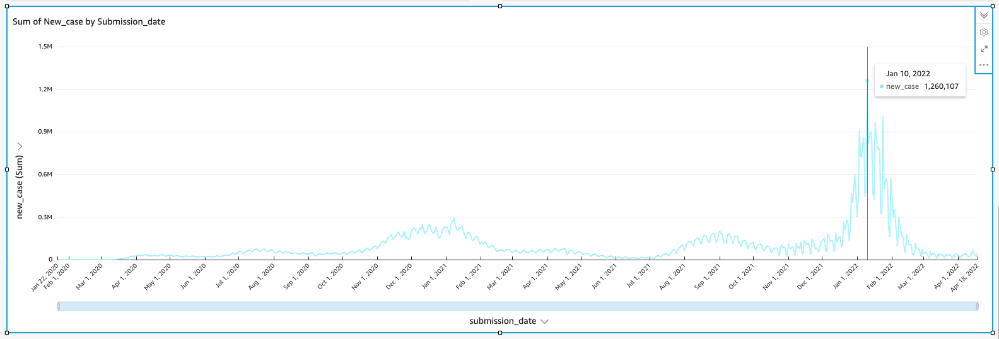

# COVID-19 Big Data Project

### Deliverable 1
---

### 1. Team

#### Project Group # 6

 *a)  Members*

Kevin Talbert, Yue Peng, Anusha Reddy

 *b)  Communication plan to include project artifact repository, meeting notes, meeting platform, etc.*

Github Repo, Email communication


### 2. Selection of data from the Open Data Registry for Amazon Web Services (https://registry.opendata.aws/)
#### COVID-19 Harmonized Data

*https://registry.opendata.aws/talend-covid19/*

Description: 
```COVID-19 Harmonized Dataset```

Resource type: 
```S3 Bucket```

Amazon Resource Name (ARN): 
```arn:aws:s3:::covid19-harmonized-dataset```

AWS Region: 
```us-east-2```

AWS CLI Access (No AWS account required): 
```aws s3 ls --no-sign-request s3://covid19-harmonized-dataset/```

*https://github.com/awslabs/open-data-registry/blob/3762670e9264571d19c14f9dfa5f7b9aedd76f74/datasets/talend-covid19.yaml*


### 3. Business Problem or Opportunity, Domain Knowledge
Because of the nature of the research, the business problem is to illuminate valuable insight into the COVID-19 Pandemic and use the data in AWS' Open Data Registry to draw analyses about COVID-19 impact and effect.

COVID-19 has significantly impacted the way of life for many people across the globe. This dataset is fascinating for multiple reasons since it reveals aggregated data from a number of recognized data sources including the World Health Organization, the New York Times, and US COVID-19 Tracking Project.
The topic is not only relevant but very crucial as COVID-19 is a pandemic effecting many today. The dataset is current and updated twice daily, according to the Registry of Open Data on AWS.

### 4. Research Objectives and Question(s)
I am interested in comparing National and State-level US COVID-19 data, particularly with respect to metadata such as geographic locations, population in states, population among age group, and population by counties. While there are a number of questions which may introduce themselves during my research, the primary nature of the below questions are aimed at analysis and usage by stakeholders such as data scientists and academics but will be presented with an end-user in mind.

~ What are the states with the highest and lowest number of confirmed COVID-19 cases?

~ How do hospitalization and death counts differ throughout the data?

~ At what time were new cases the highest nationally?

~ What interesting statistics can be observed from the dataset?


### Deliverable 2
---

### 5. Data Understanding

 *a)   Exploratory Data Analysis*
 
 Exploratory Data Analysis was done through AWS Sagemaker. View the rendered file here: [Exploratory Data Analysis](Project-Files/AWS-Sagemaker/ExploratoryDataAnalysis.ipynb)

 *b)   Dashboard*

 Dashboard instances were created using AWS Quicksight and rendered as PDF files; however, due to billing limitations, the Dashboard instances are shutdown after analysis. The PDF extracts are available below. Additionally, these dashboards are analyzed in the Results section as a tool for evaluating the research objectives and questions.
 
 [US/National Covid-19 Dashboard PDF Extract](Project-Files/AWS-Quicksight/Dashboard_Analysis_o_2022-04-19T23_34_09.pdf)
 
 [US State-Level Covid-19 Dashboard PDF Extract](Project-Files/AWS-Quicksight/CDC_State_Data_Analy_2022-04-19T23_32_15.pdf)


### 6. Data Preparation
Data preparation was done at all levels of the project, including preliminary analysis of the dataset structures documented in the Open Dataset Registry. Data preparation activities include interpreting column data properly based on the tool being utilized, considering outlier data, invalid values, performing data manipulation, and more. Data preparation activities also included determining the most efficient tool to use in order to answer questions set forth by the research objectives and questions.


### Deliverable 3
---

### 7. Analytics, Machine Learning
Analytics and Machine Learning are done through Amazon ML tools on SageMaker. Analytics and ML techniques included utilizing kernel density functions (KDE), heatmaps for correlation, and linear regression models. View the rendered results below:

 [Analytics and ML Modeling of Covid-19 Data](Project-Files/AWS-ML/Analytics-and-ML-Modeling.ipynb)

See [Results](#9-results) below for continued discussion on Analytics and Machine Learning Modeling utilization to answer the Research Objectives and Questions.


### 8. Evaluation and Optimization
Using AWS allowed for significant performance boosts when running computations. Linear Regression models are employed as well as correlation mappings and outlier plots to further ensure data is evaluated using the proper methodology. AWS has numerous machine learning models and analytics capabilities available and Linear Regression was chosen as it is an excellent way to show trends and correlation between datasets. Using a KDE plot (kernel density function), the data scientist can visualize the probability density of each data column of significance. Using a KDE function and heatmap help to improve setting up models since the models can be optimized for the best fit.


### 9. Results
It is important to understand the results in the context of the various [questions](#4-research-objectives-and-questions) asked from an end-user perspective:

#### ~ What are the states with the highest and lowest number of confirmed COVID-19 cases?

This question was asked in order to understand the highs and lows of where COVID-19 was most prevalent. The top 20 states for Covid cases and deaths are shown by the graphs below:



California had the highest number of total cases (2,548,525,617) and total deaths (34,212,719) based on the dataset. 

Texas had the second highest number of total cases (2,024,454,101) and total deaths (32,112,207). 

Florida had the third highest number of total cases (1,715,014,408) and total deaths (26,486,263). 

States with the lowest number of Covid-19 cases and deaths included Vermont, Wyoming, and Alaska. Rationalizing this with the geography and population of those three states, these results are understandable.


####  ~ How do hospitalization and death counts differ throughout the data?

This question aimed to understand how hospitalizations and deaths differed between national and state data. Based on the results of the analytics and machine learning modeling, it was observed that there was a strong correlation between hospitalizations and deaths which makes sense with what we know about Covid-19 significantly impacting hospitals. Additionally, the state data reflected a small chance that confirmed cases would result in death. Using the examples discussed previously (California, Texas and Florida), we see a 1.34% chance in California, a 1.59% chance in Texas, and a 2.89% chance in Florida that contracting Covid-19 would lead to death. This data is shown interactively through the AWS Quicksight Dashboard created as well (See PDF extracts in [Data Understanding](#5-data-understanding) above). While these numbers may fluctuate slightly by state, they generally stay very small and under 2%.


#### ~ At what time were new cases the highest nationally?

Cases were the highest nationally around the end of December 2021 through mid-to-late January 2022. The graph below illustrates the single highest day recorded based on the CDC state's data, created on AWS Quicksight, as well as the significant leap in cases during this time frame:




#### ~ What interesting statistics can be observed from the dataset?

Importantly, this question was open-ended from the start to promote reflection on anomolies and interesting data points observed during and throughout data ingestion, analysis, and results finding. Several points emerged and are noted below:

*Patients on ventilators spiked between the beginning of April 2020 through July 2020 as well as the beginning of November 2020 through February 2021.*

*Confirmed deaths and total death counts varied in proximity between states. This was interesting as it is a metric created by the CDC for additional verification that a death was indeed due to Covid-19 and not other extenuating factors; however, for the most part these numbers were in close range to one another.*

*Between Dec 26, 2021 and February 3, 2022, the US saw it's largest number of new cases recorded by over 400% of any previous counts of new cases.*


### 10. Future Work, Comments

#### What was unique about the data?  Did you have to deal with imbalance? What data cleaning did you do? Outlier treatment?  Imputation?
Several factors made this data unique. The dataset resources came from many different data sources so ensuring quality data as inputs was key. Understanding the data in the context of where it was being sourced also was important. This data, while it was obtained from reputable sources, had extra information (such as cities which reported data in addition to the state data), which made it critical to clean and filter. For example, the dataset included New York City and New York, but the relevant considerations were around state data, not necessary city data. It is crucial for the data scientist to understand the data. As far as imputation, non-existing, or NaN values are concerned, the dataset had numerous data points which had to be standardized. (This was done during the Data Understanding and Preparation phases.)

#### Did you create any new additional features / variables?
While there were no new variables, there were certainly several features that were created. For starters, the dashboards created in AWS Quicksight as well as the heatmap and regression models created during the Analytics/ML modeling phase allowed for advanced inquiry into the dataset. 

#### What was the process you used for evaluation?  What was the best result?
Evaluating results in the context of known data is crucial. A wealth of resources are becoming available for obtaining COVID-19 data and verifying the results received with the data already existing was crucial to evaluating the data both historically and analytically. In other words, by using a public dataset shared by other data scientists, the results obtained can be proven accurate. Additionally, linear regression proved to be invaluable in assessing the data after figuring out which model would prove to be most useful from the correlation heatmap, for the data of interest to the Research Objectives/Questions.

#### What were the problems you faced? How did you solve them?
The main problems surrounded billing and setup of AWS. AWS presents a unique challenge in that unlike other cloud providers, it requires a credit card on file and does not handle resource management in the same way as Google Cloud Platform or Microsoft Azure. Additionally, several of the data operations (such as analyzing data across an entire S3 bucket) presented as too costly and therefore subsets of the data were used to answer the research objectives and questions; determining which subsets, and their source was a unique challenge; however, these datasets were available and just required an understanding of the locality of the total S3 dataset.

#### What future work would you like to do? 
Future work would include operationalizing the data; meaning, publishing the data views to Heroku or a similar deployment service for public access and consumption. A web app with the interactivity of charts like Bokeh could prove beneficial to an end-user in navigating and understanding the data presented in the project.

#### Implementation of Work / Presentation Video
Below are narrated presentation videos of the deliverables presented in this project repo:

https://user-images.githubusercontent.com/32403721/166989905-c670f61f-e53d-4b67-8e51-1fec61eacf4f.mp4

[Deliverable 1 Video](Project-Files/Deliverable-Videos/Deliverable1.mp4)


https://user-images.githubusercontent.com/32403721/166990079-0a6e80ea-4c13-4eb8-9640-c2a4699d4395.mp4

[Deliverable 2 Video](Project-Files/Deliverable-Videos/Deliverable2.mp4)


https://user-images.githubusercontent.com/32403721/166990237-9570f497-1469-47eb-954f-6ba2c34d7296.mp4

[Deliverable 3 Video](Project-Files/Deliverable-Videos/Deliverable3.mp4)
